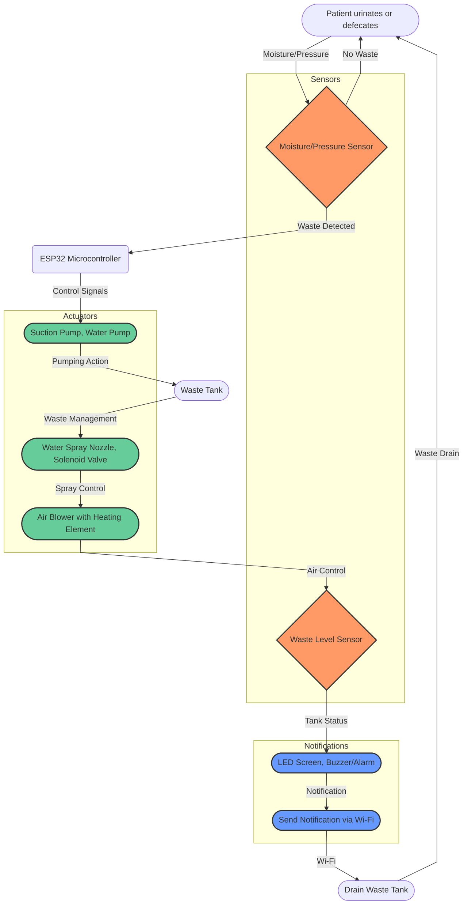

# Automated Sanitation Facility for Bedridden

## Features
- **Automatic Waste Detection and Disposal:** Employs sensors to detect waste and trigger the cleaning process.
- **Integrated Cleaning System:** Incorporates mechanisms for waste removal, water spraying, and hot air drying.
- **IoT Connectivity:** Enables remote monitoring of the system's status and sends notifications to caregivers.
- **User-Friendly Interface:** Includes an LED screen and alarm for local feedback, with the option for a mobile app for remote interaction.

## Possible Uses
- Hospitals and healthcare facilities
- Home care settings for elderly or disabled individuals
- Rehabilitation centers
- Nursing homes

## Hardware
- **ESP32 Microcontroller**

### Sensors
- **Moisture/Pressure Sensor:** Detects the presence of waste.
- **Waste Level Sensor:** Monitors the waste tank's fullness.
- **Water Level Sensor:** Monitors the water tank's level.

### Actuators
- **Suction Pump:** Removes waste from the bed unit.
- **Water Pump:** Supplies water for cleaning.
- **Air Blower with Heating Element:** Provides hot air for drying.
- **Solenoid Valve:** Controls water flow for spraying.

### User Interface
- **LED Screen & Buzzer/Alarm:** Provides local feedback and alerts.
- **Mobile App (Arduino Cloud):** Optional remote interaction platform.

## Flowchart

## This approach fulfills the following requirements for bedridden patients with the corresponding components:

- Automatic Waste Detection:
> Components: Moisture/pressure sensors detect urine or feces.
- Waste Removal:
> Components: suction pump extracts waste from the bed unit.
- Cleaning:
> Components: water pump and spray nozzle clean the affected area.
- Drying:
> Components: air blower with a heating element dries the cleaned area.
- Monitoring and Alerts:
> Components: Waste and water level sensors monitor tank levels, triggering an alarm and LED notification when full or empty. The ESP32 microcontroller sends alerts to caregivers via Wi-Fi.
- Hygiene:
> Components: The entire process is automated, minimizing human contact and reducing the risk of infection.
