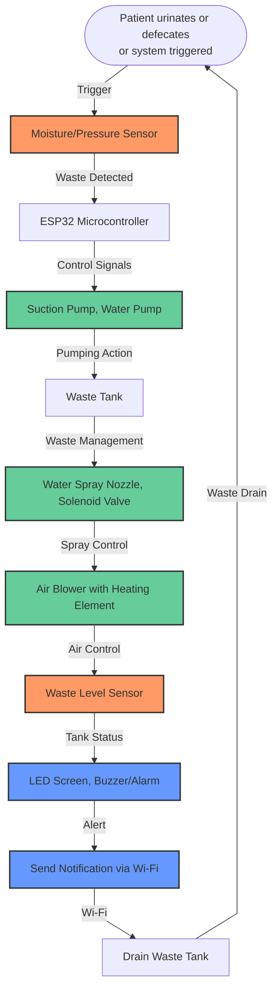

# Automated Sanitation Facility for Bedridden

### This document outlines a proposed technical concept for an automated sanitation system designed to improve the quality of life for bedridden individuals.
> Confidential - For Discussion Purposes Only

## Features
- **Automatic Waste Detection and Disposal:** Employs sensors to detect waste and trigger the cleaning process.
- **Integrated Cleaning System:** Incorporates mechanisms for waste removal, water spraying, and hot air drying.
- **IoT Connectivity:** Enables remote monitoring of the system's status and sends notifications to caregivers.
- **User-Friendly Interface:** Includes an LED screen and alarm for local feedback, with the option for a mobile app for remote interaction.

## Possible Uses
- Hospitals and healthcare facilities
- Home care settings for elderly or disabled individuals
- Rehabilitation centers
  
## Hardware
| Component              | Description                                       | Model/Type                               |
|------------------------|---------------------------------------------------|------------------------------------------|
| Microcontroller        | Controls all sensors, actuators, and communication. | ESP32-DevKitC     |
| Moisture/Pressure Sensor | Detects the presence of waste. (optional- if required)                 | FS2040 Moisture Sensor   |
| Waste Level Sensor     | Monitors the fullness of the waste tank.          | JSN-SR04T Ultrasonic Sensor     |
| Water Level Sensor     | Monitors the water level in the reservoir.        | SEN-18186 Liquid Level Sensor|
| Suction Pump           | Extracts waste from the bed unit.                 | 240V AC Peristaltic Pump / As preffered               |
| Water Pump             | Supplies water for cleaning.                      | 240V AC Centrifugal/ As preffered      |
| Air Blower             | For drying.                     | 240V AC blower                       |
| Solenoid Valve         | Controls the flow of water for spraying.          | 240V AC Solenoid Valve                   |
| Relay Module           | Controls the 240V AC actuators.                  | 4-Channel 240V AC Relay Module           |
| Relay Driver Circuit   | Provides isolation between the ESP32 and the high-voltage relay module. | Optocouplers or Solid State Relays |
| LED Screen & Buzzer/Alarm | Provides local feedback and alerts.            | -                                        |
| Mobile App             | Allows remote monitoring and sends notifications to caregivers. | Arduino Cloud                           |

## Flowchart

> This system offers a hygienic solution for individuals with limited mobility by automating waste detection, removal, cleaning, and drying. It aims to enhance comfort, dignity, and infection control.
